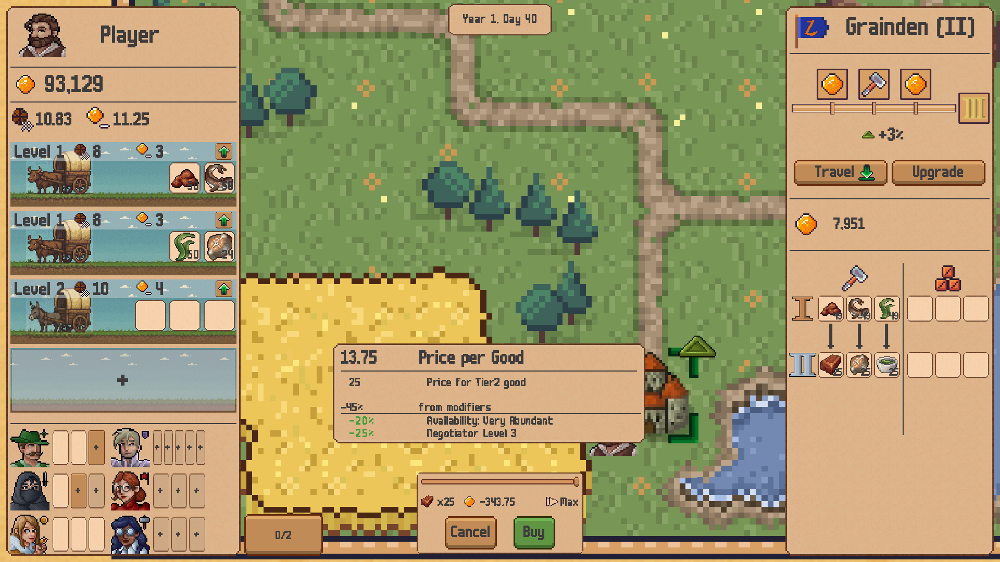

<h1>Medieval Merchant <i>(working title)</i></h1>

Medieval Merchant is a strategy and trading simulation game built in Unity (C#). You manage a traveling caravan, buy and sell goods across a dynamically evolving medieval world, and help towns prosper and grow through trade. The game will be realeased on Steam for free once it is ready.

<h2>Game Overview</h2>

- **Dynamic World Economy**: Towns produce resources based on their surrounding regions. The player aims to trade these resources to help disparate towns thrive by connecting them to foreign resources.
- **Town Development System**: Towns start as poor, small settlements. With the help of the player they can start producing resources, accumulate wealth and develop into larger and larger settlements.
- **Caravan and Retinue Management**: As the player trades at a profit, they can invest some of the gathered coin into their own caravan and companions, which helps them in their further trade.

<h2>Technical Highlights</h2>

- **Data-Driven Architecture using ScriptableObjects**: All goods, recipes, and town configurations are data-driven via ScripableObjects for flexible balancing and iteration.
- **Model-Driven Gameplay**: All live gameplay data is managed in a model layer which is observable by UI and GameObjects to present the data to the player.
- **Dynamic Tooltip System**: The UI only shows the data that is of highest importance to the user at a glance. All secondary information is displayed through a dynamic tooltip system which keeps the screen clutter at a minimum while providing detailed information on-demand.
- **Modifiable Variables**: Everything is modifiable! All gameplay data is built to be modifiable through e.g. gameplay events, player upgrades, level settings, etc. For example, the price of berries depends on the base price, the level of the negotiator companion, a global event "Food Shortage", the avialablity of berries in that given town, your relation ship with that town, etc.

<h2>Current Focus</h2>

- Expanding game modifiers, such as level-specific events, in-game events that last a few days/weeks.
- Adding more detailed gameplay around the needs of towns, such as requirements to allow towns to upgrade or town-specific demands.
- Balancing trade and growth values as well as the speed of the gameplay.
- Polishing UI and getting early player feedback
